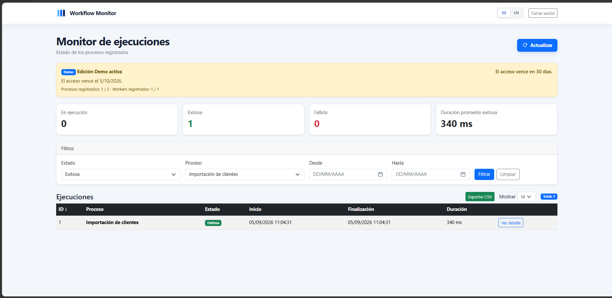

<p>
  
</p>

# Workflow Monitor

**SQL workflow execution monitoring for .NET and SQL Server.**

Workflow Monitor provides a local dashboard and REST API for tracking backend processes, Workers, imports, batch jobs and other SQL-backed workflows.

## Why it exists

Business-critical backend processes often run without a single operational view. When a batch, integration, Worker, import, or stored procedure fails—or remains active longer than expected—teams may need to reconstruct what happened from scattered logs, direct database queries and manual checks.

Workflow Monitor centralizes the execution evidence needed to answer:

- What ran, when, and for how long?
- Is it still running, completed successfully, failed, or cancelled?
- How many records were processed correctly or incorrectly?
- How many rows were affected?
- What error was reported?
- Which executions appear stale or unusually long-running?
- What happened for a selected process and date range?

## Main capabilities

- REST API to start, finish, list and inspect executions
- Execution states: `Running`, `Succeeded`, `Failed` and `Cancelled`
- Authenticated MVC dashboard
- Process-level execution history and detail
- Start time, completion time, duration and stale-execution detection
- Processing metrics: total, correct, incorrect and affected rows
- Error information for failed executions
- Filtering, sorting, pagination and CSV export
- Worker Service for CSV processing and stored-procedure integration
- SQL Server staging, transactions, procedures and consistency constraints
- API-key authentication for Workers and integrations
- Local administrator authentication
- Spanish and English localization
- Rate limiting, defensive browser headers, safe errors and health checks
- Offline signed-license validation for commercial editions
- Demo access rules and capacity limits
- Windows Service hosting for Web/API and Worker

## Screenshots

### Execution monitor


### Execution detail


### Filtered executions



## Architecture

```text
                    Browser
                       |
                       v
             Workflow Monitor Web
               MVC + REST API
                       |
                       v
                   SQL Server
                       ^
                       |
             Workflow Monitor Worker
```

The Windows installation runs the Web/API and Worker as Windows services. Monitoring data remains in the configured SQL Server environment.

Detailed architecture: [docs/ARCHITECTURE.md](docs/ARCHITECTURE.md)

## Editions and pricing

Workflow Monitor uses capacity-based licensing for on-premises installations. Professional and Enterprise use the same monitoring core; the licensed limits determine the number of registered processes and Workers/integrations.

| Edition | Price | Registered processes | Workers / integrations | Intended use |
|---|---:|---:|---:|---|
| **Demo** | Free | Up to 3 | 1 | 30-day technical evaluation |
| **Professional** | **USD 15/month** or **USD 149/year** | Up to 25 | Up to 5 | Small production environments and focused backend teams |
| **Enterprise** | **USD 39/month** or **USD 399/year** | Up to 100 | Up to 20 | Larger production environments and multiple integrations |
| **Enterprise Custom** | Contact | More than 100 | More than 20 | Multiple installations or custom capacity requirements |

Annual billing is discounted compared with 12 monthly payments. Each paid license is issued for a specific installation and billing period. Commercial packages are distributed separately from the public Demo.

- [Planes comerciales — Español](docs/PLANES-COMERCIALES-ES.md)
- [Commercial plans — English](docs/COMMERCIAL-PLANS-EN.md)
- Commercial inquiries: **contacto@federicostimpfl.com.ar**

## Demo edition

The installable Demo is intended for technical evaluation.

| Demo limit / capability | Value |
|---|---:|
| Evaluation period | 30 days |
| Registered processes | Up to 3 |
| Workers / integrations | 1 |
| CSV export | Enabled |
| Dashboard and REST API | Enabled |
| Real execution processing | Enabled |
| After expiration | Read-only |

The process and Worker limits apply to registered identifiers, not to a simultaneous-execution count. After expiration, existing history and details remain available while new executions are no longer registered.

The Demo is a Windows x64 self-contained package.

## Latest version

**Workflow Monitor 1.1.3** — September 5, 2026

Version 1.1.3 finalizes the validated Windows installer/uninstaller and packaging hardening, corrects Spanish CSV export for Excel compatibility, and updates the installation guidance for the current unsigned installer distribution.

## Download

The public Demo is distributed through **GitHub Releases** together with its SHA-256 checksum.

**Windows SmartScreen:** the current Demo installer is not digitally signed with a trusted Authenticode certificate. Windows may therefore display **Windows protected your PC**. This expected unsigned-publisher warning does not by itself mean that Defender detected malware. Download only from this repository, verify the published SHA-256 checksum, and see the [installation instructions](docs/INSTALLATION.md) before running the installer.

[Go to Releases](https://github.com/stimpfldev/WorkflowMonitor/releases)

## Documentation

- [Quick walkthrough](docs/WALKTHROUGH.md)
- [Installation instructions](docs/INSTALLATION.md)
- [Demo scope and limitations](docs/DEMO.md)
- [Architecture](docs/ARCHITECTURE.md)
- [Secure deployment baseline](docs/SECURITY-DEPLOYMENT.md)
- [Planes comerciales — Español](docs/PLANES-COMERCIALES-ES.md)
- [Commercial plans — English](docs/COMMERCIAL-PLANS-EN.md)
- [Security policy](SECURITY.md)
- [Support policy](SUPPORT.md)
- [Legal materials](Legal/README.md)
- [EULA — Español](Legal/EULA-ES.txt)
- [EULA — English](Legal/EULA-EN.txt)
- [Third-party notices](Legal/THIRD-PARTY-NOTICES.txt)
- [Public distribution notice](LICENSE.txt)
- [Release history](CHANGELOG.md)

### Word documentation

- [Manual de instalación y uso — ES 1.1.3](docs/SqlWorkflowMonitor_Manual_de_Instalacion_y_Uso_ES_1.1.3.docx)
- [Installation and User Guide — EN 1.1.3](docs/SqlWorkflowMonitor_Installation_and_User_Guide_EN_1.1.3.docx)
- [Descripción comercial — ES 1.1.3](docs/SqlWorkflowMonitor_Descripcion_Comercial_ES_1.1.3.docx)
- [Product Overview — EN 1.1.3](docs/SqlWorkflowMonitor_Product_Overview_EN_1.1.3.docx)

## Requirements

- Windows x64
- SQL Server available locally or through a reachable SQL Server instance
- Administrator permissions during installation
- A modern web browser

The Demo package is self-contained; installing a separate .NET runtime is not required.

## Commercial editions

Professional and Enterprise use offline signed licenses tied to the installation. The license carries its expiration date, maximum registered processes and maximum Workers/integrations, so monthly and annual billing use the same product build with different license periods.

Commercial packages are distributed separately and are not published in this repository.

## Repository scope

This repository is the **public product and distribution surface** for Workflow Monitor. It intentionally does not contain the private commercial source code, license-generation tooling, internal build scripts, private signing material, issued licenses or customer-specific packages.

---

### Resumen en español

Workflow Monitor permite registrar y consultar ejecuciones de procesos backend y SQL desde un dashboard web, con API REST, Worker, filtros, métricas de procesamiento, detección de ejecuciones demoradas y exportación CSV.

La Demo permite una evaluación técnica de 30 días con hasta 3 procesos y 1 Worker/integración. Professional admite hasta 25 procesos y 5 Workers por USD 15/mes o USD 149/año. Enterprise admite hasta 100 procesos y 20 Workers por USD 39/mes o USD 399/año. Al vencer una licencia deja de admitir nuevas ejecuciones conforme a las reglas de acceso del producto, preservando la información existente según corresponda.
